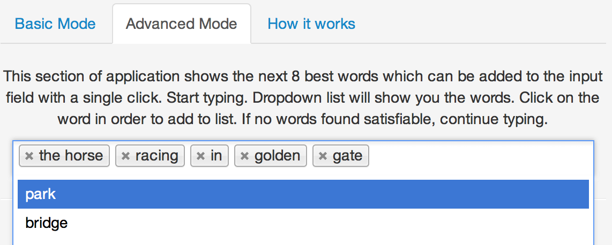

Prediction of the Next Word.
========================================================
author: Amira Mohamed Abdelsa;am
date: 30 Aug 2019


Overview
========================================================

Modern applications are looking for artistic ways to use data science to improve user interactions.

This work is an example of application where the most routine part of interaction with computer - typing of the words - was improved with scientific methods.

The goal of application is to predict the word the user will enter next. It can be used in mobile devices development or in complex environmnets. 

Moreover, the algorithms and statistical models which were used to build the application can be applied to any area of human language recognition.


Application Features
========================================================

- The main screen of application has input field to enter text while application will update the screen with the best predicted word.
- Advanced Mode shows a dropdown with the best 8 words. User can select them in one click.
- Advanced Mode is needed to simplify the user experience, while Basic mode is the best to test the predictive qualities of the algorithm.




Predictive Model
========================================================
- Predictive model uses 10% of the initial corpus of the text. After removal of singletones it gives 202431 unique words.
- Based on the corpus, application generates n-grams from 1st to 5th order.
- Having very sparse corpus of texts, all singletones were eliminated from all the n-grams, including unigrams to save space.
- Probabilities of n-grams were calculated using recursive Kneser-Ney smoothing for 5-grams

- When the Next Word is predicted, application first tries to find all 5-grams where last 4 words were seen. It picks the one with the highest probability.
- If no word was found in 5-gram, it backs off to lower-order n-gram and searches all 4-grams based on last 3 words, etc.

Optimization
========================================================
- In order to reduce the storage space needed for n-grams and increase performance of join and search operations on them, application operates just with integer identifiers of the words, not words itself.
- Database of n-grams is stored in SQLite database, in the format [id1, id2, id3 .. id5, PKN], where ids are identifiers of the words and PKN is precalculated Kneser-Ney probability

```
            x       y        a          pkn
1000 11732504 5726590 10534262 1.693407e-06
1001 11805148 5727687 11799963 1.693407e-06
1002 11519994 5728652 11794160 1.693407e-06
```
- N-grams are loaded from database when application starts and then it performs all operations on data in memory. It uses data.table library to do join operations on n-grams of different order.

Predictive Model Accuracy 
========================================================

- In order to evaluate the performance of the algorithm, community developed [Benchmarking Tool](https://github.com/hfoffani/dsci-benchmark) was used.
- The overall accuracy of the prediction is 17.37%. It takes 73.99 msec in average to produce results and it uses 51.24MB of RAM at runtime total to run all the tests.
- Database is build on 202431 unique words and needs 63Mb of the space on disk. 


```
                    metric result units
1     Overall top-3 score:  17.37     %
2 Overall top-1 precision:  12.69     %
3 Overall top-3 precision:  21.46     %
4        Average runtime:   73.99  msec
5   Number of predictions:  28464      
6       Total memory used:  51.24    MB
```

Extra Features
========================================================
- Having very fast search operation on probabilities it was possible to implement additional feature called "Cloud of Words".
- It shows next possible 40 words sized in proportion to their probabilities.

- This feature is just for fun!
